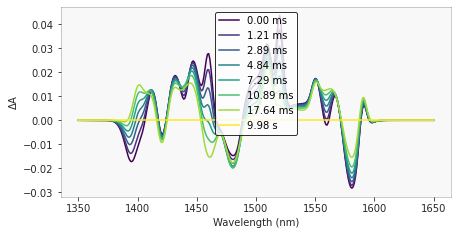
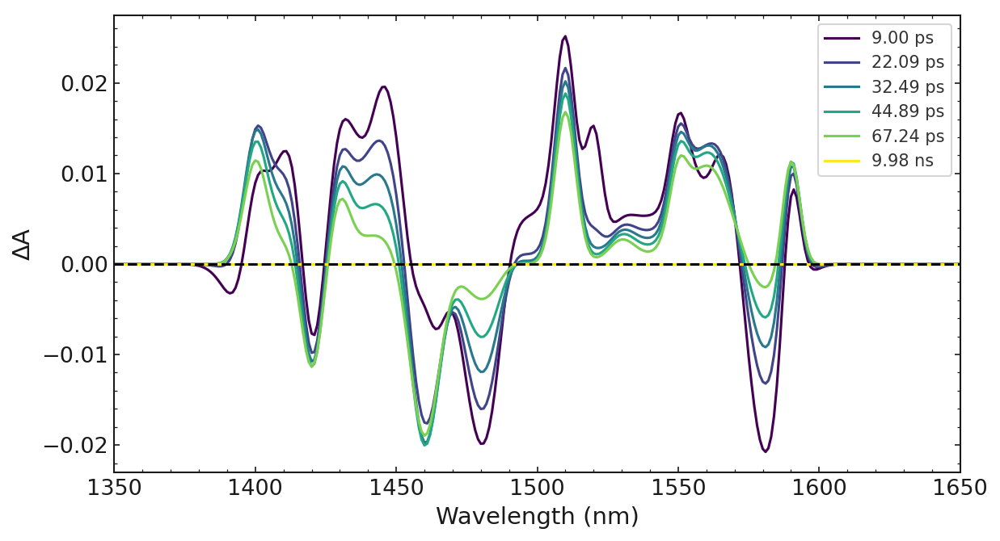
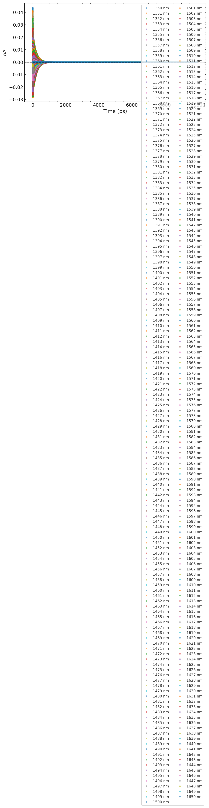
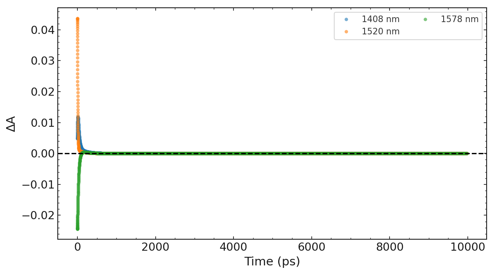
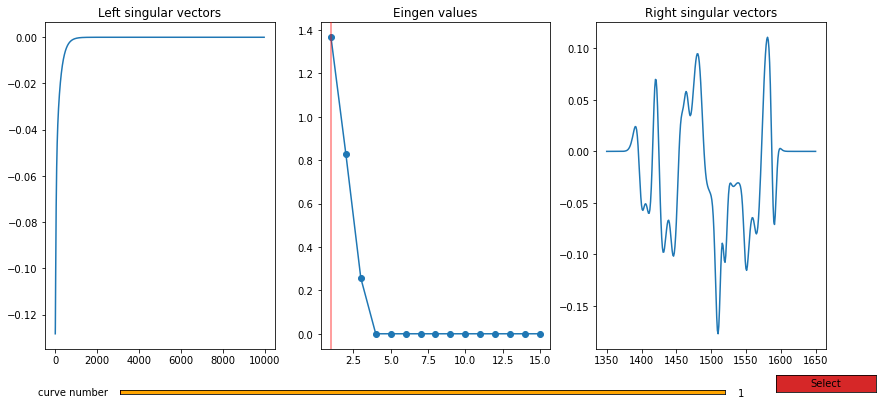

# Ultrafast package usage
---
## Setting-up


```python
from ultrafast.experiment import Experiment
from ultrafast.utils.divers import get_root_directory, read_data
import os
```


```python
path = os.path.join(
	get_root_directory(),
	'examples', 'data', 'denoised_2.csv')
```

---
## Data loading
To load an experiment, there are two possibilities, you can either enter the path to your `csv` data:


```python
experiment = Experiment.load_data(path, wave_is_row=True)
experiment.x.shape, experiment.data.shape, experiment.wavelength.shape
```


    ((1000,), (1000, 301), (301,))


or you can supply the `time`, `data` and `wave` arrays using:


```python
time, data, wave = read_data(path, wave_is_row= True)
experiment = Experiment(time, data, wave)
time.shape, data.shape, wave.shape
```


    ((1000,), (1000, 301), (301,))


---
## Data exploration
The first thing to do is to explore the data set loaded

To explore the spectral dimension use the "plot_spectra" method
By default all spectra will be plotted 
(Except if there are more than 250 which is the case here)


```python
experiment.plot_spectra('auto', style='light')
```

    1520.0
    style applied


    (<Figure size 504x252 with 1 Axes>,
     <AxesSubplot:xlabel='Wavelength (nm)', ylabel='$\\Delta$A'>)


    

    


```python

# From the figure we observe that 8 spectra equally spaced
# at 1520 nm are displayed.

# To plot plot a different number of traces automatically use the following format
# ['auto', 6, 1480] six spectra plotted equally spced at 1480
experiment.plot_spectra(times=['auto', 6, 1480])

# To explore the time dimension use "plot_traces" method
# This function plots by default the selected traces except 
# If traces is set to 'auto' 10 traces separated equally in spectra dimension
# are display
experiment.plot_traces()

# alternatively we can pass a list of traces value (according to wave vector)
experiment.plot_traces([1408,1520,1578])

# To explore the number of components is possible to use the singular value decomposition (SVD)
# The SVD reveal that the data set is compose by three components
experiment.plotSVD(1, True)

# After selecting the SV this can be plot again with "plot_traces" function
experiment.plot_traces()

# The original traces can be selected again with "select_traces" method
experiment.select_traces(points='all')

# To perform a global fit normally is not perform over the complete data set
# but over a selection of traces. Selecting traces is easy with "select_traces"
# function. To select a series of traces indicate the separation value.
# The selected traces will be separated 10 points in the wave vector
experiment.select_traces(points=10, average=0)

# UNITS
# -----
# Experiment automatically handles unit of figures via two attributes
# Modifying the units automatically modify figures axis and legends
# time_unit by default "ps"
# wavelength_unit by default "nm"
experiment.time_unit 
# >>> 'ps'
experiment.time_unit = 'us'
experiment.time_unit 
# >>> 'μs'
experiment.time_unit = 'millisecond'
experiment.time_unit 
# >>> 'ms'

experiment.wave_unit 
# >>> 'nm'
experiment.wave_unit = 'wavenumber'
experiment.wave_unit 
# >>> 'cm-1'
experiment.wave_unit = 'nanometer'
experiment.wave_unit 
# >>> 'nm'
experiment.wave_unit = 'cm'
experiment.wave_unit 
# >>> 'cm-1'

# DATA FITTING
# ------------
# The first step to perform a fitting is to initialize the model and the parameters.
# For a classical exponential fitting use "initial_exp_params" function.
# the first parameters to indicate is t0 and fwhm which indicates if the exponential
# fit is modified with a gaussian function. For this data set t0 = 0, and fwhm = None
# Since we dont have the signal raising. Then the initial guess for the fit are given.
# The SVD reveled that 3 component where needed, and values are given after plotting 
# several traces.
#                               (t0, fwhm, t1, t2, t3)
experiment.initialize_exp_params(0, None, 4, 60, 500)

# now we are ready to fit the data with "final_fit" method, this will previously
# run a prefit 
experiment.global_fit()

# RESULTS EXPLORING
# -----------------
# For any fit the first thing is to print the results which can be done with the
# "print_results" method (If none fit number is passed the last performed fit
# will be consider)
experiment.print_results()

# >>> Fit number 1: 	Global Exponential fit
# >>> -------------------------------------------------
# >>> Results:	Parameter		Initial value	Final value		Vary
# >>>			time 0:   		0.0000   		0.0000   		False
# >>>			tau 1:   		4.0000   		8.0000   		True
# >>>			tau 2:   		60.0000   		30.0000   		True
# >>>			tau 3:   		500.0000   		200.0000   		True
# >>> Details:
# >>> 		Number of traces: 30; average: 0
# >>> 		Fit with 3 exponential; Deconvolution False
# >>> 		Tau inf: None
# >>> 		Number of iterations: 994
# >>> 		Number of parameters optimized: 240
# >>> 		Weights: False

# The following step is plot the fit and residual plot which is done with the 
# "plot_fit" method
experiment.plot_fit()

# finally the Decay Associated Spectra (DAS) can be plotted with the plot_DAS method
experiment.plot_DAS()


```

    1480.0
    style applied
    style applied
    style applied


    /home/lucla/Work/Local/ultrafast/ultrafast/graphics/PlotSVD.py:101: UserWarning: Matplotlib is currently using module://matplotlib_inline.backend_inline, which is a non-GUI backend, so cannot show the figure.
      self._fig.show()


    style applied


    ---------------------------------------------------------------------------

    AttributeError                            Traceback (most recent call last)

    /tmp/ipykernel_153893/876171132.py in <module>
         46 # >>> 'ms'
         47 
    ---> 48 experiment.wave_unit
         49 # >>> 'nm'
         50 experiment.wave_unit = 'wavenumber'


    AttributeError: 'Experiment' object has no attribute 'wave_unit'


    

    


    

    


    

    


    

    


    Error in callback <function flush_figures at 0x7f8ff8d333a0> (for post_execute):


    ---------------------------------------------------------------------------

    KeyboardInterrupt                         Traceback (most recent call last)

    ~/miniconda3/envs/ultrafast/lib/python3.9/site-packages/matplotlib_inline/backend_inline.py in flush_figures()
        119         # ignore the tracking, just draw and close all figures
        120         try:
    --> 121             return show(True)
        122         except Exception as e:
        123             # safely show traceback if in IPython, else raise


    ~/miniconda3/envs/ultrafast/lib/python3.9/site-packages/matplotlib_inline/backend_inline.py in show(close, block)
         39     try:
         40         for figure_manager in Gcf.get_all_fig_managers():
    ---> 41             display(
         42                 figure_manager.canvas.figure,
         43                 metadata=_fetch_figure_metadata(figure_manager.canvas.figure)


    ~/miniconda3/envs/ultrafast/lib/python3.9/site-packages/IPython/core/display.py in display(include, exclude, metadata, transient, display_id, *objs, **kwargs)
        318             publish_display_data(data=obj, metadata=metadata, **kwargs)
        319         else:
    --> 320             format_dict, md_dict = format(obj, include=include, exclude=exclude)
        321             if not format_dict:
        322                 # nothing to display (e.g. _ipython_display_ took over)


    ~/miniconda3/envs/ultrafast/lib/python3.9/site-packages/IPython/core/formatters.py in format(self, obj, include, exclude)
        178             md = None
        179             try:
    --> 180                 data = formatter(obj)
        181             except:
        182                 # FIXME: log the exception


    ~/miniconda3/envs/ultrafast/lib/python3.9/site-packages/decorator.py in fun(*args, **kw)
        230             if not kwsyntax:
        231                 args, kw = fix(args, kw, sig)
    --> 232             return caller(func, *(extras + args), **kw)
        233     fun.__name__ = func.__name__
        234     fun.__doc__ = func.__doc__


    ~/miniconda3/envs/ultrafast/lib/python3.9/site-packages/IPython/core/formatters.py in catch_format_error(method, self, *args, **kwargs)
        222     """show traceback on failed format call"""
        223     try:
    --> 224         r = method(self, *args, **kwargs)
        225     except NotImplementedError:
        226         # don't warn on NotImplementedErrors


    ~/miniconda3/envs/ultrafast/lib/python3.9/site-packages/IPython/core/formatters.py in __call__(self, obj)
        339                 pass
        340             else:
    --> 341                 return printer(obj)
        342             # Finally look for special method names
        343             method = get_real_method(obj, self.print_method)


    ~/miniconda3/envs/ultrafast/lib/python3.9/site-packages/IPython/core/pylabtools.py in <lambda>(fig)
        251 
        252     if 'png' in formats:
    --> 253         png_formatter.for_type(Figure, lambda fig: print_figure(fig, 'png', **kwargs))
        254     if 'retina' in formats or 'png2x' in formats:
        255         png_formatter.for_type(Figure, lambda fig: retina_figure(fig, **kwargs))


    ~/miniconda3/envs/ultrafast/lib/python3.9/site-packages/IPython/core/pylabtools.py in print_figure(fig, fmt, bbox_inches, **kwargs)
        135         FigureCanvasBase(fig)
        136 
    --> 137     fig.canvas.print_figure(bytes_io, **kw)
        138     data = bytes_io.getvalue()
        139     if fmt == 'svg':


    ~/miniconda3/envs/ultrafast/lib/python3.9/site-packages/matplotlib/backend_bases.py in print_figure(self, filename, dpi, facecolor, edgecolor, orientation, format, bbox_inches, pad_inches, bbox_extra_artists, backend, **kwargs)
       2253                 # force the figure dpi to 72), so we need to set it again here.
       2254                 with cbook._setattr_cm(self.figure, dpi=dpi):
    -> 2255                     result = print_method(
       2256                         filename,
       2257                         facecolor=facecolor,


    ~/miniconda3/envs/ultrafast/lib/python3.9/site-packages/matplotlib/backend_bases.py in wrapper(*args, **kwargs)
       1667             kwargs.pop(arg)
       1668 
    -> 1669         return func(*args, **kwargs)
       1670 
       1671     return wrapper


    ~/miniconda3/envs/ultrafast/lib/python3.9/site-packages/matplotlib/backends/backend_agg.py in print_png(self, filename_or_obj, metadata, pil_kwargs, *args)
        506             *metadata*, including the default 'Software' key.
        507         """
    --> 508         FigureCanvasAgg.draw(self)
        509         mpl.image.imsave(
        510             filename_or_obj, self.buffer_rgba(), format="png", origin="upper",


    ~/miniconda3/envs/ultrafast/lib/python3.9/site-packages/matplotlib/backends/backend_agg.py in draw(self)
        404              (self.toolbar._wait_cursor_for_draw_cm() if self.toolbar
        405               else nullcontext()):
    --> 406             self.figure.draw(self.renderer)
        407             # A GUI class may be need to update a window using this draw, so
        408             # don't forget to call the superclass.


    ~/miniconda3/envs/ultrafast/lib/python3.9/site-packages/matplotlib/artist.py in draw_wrapper(artist, renderer, *args, **kwargs)
         72     @wraps(draw)
         73     def draw_wrapper(artist, renderer, *args, **kwargs):
    ---> 74         result = draw(artist, renderer, *args, **kwargs)
         75         if renderer._rasterizing:
         76             renderer.stop_rasterizing()


    ~/miniconda3/envs/ultrafast/lib/python3.9/site-packages/matplotlib/artist.py in draw_wrapper(artist, renderer, *args, **kwargs)
         49                 renderer.start_filter()
         50 
    ---> 51             return draw(artist, renderer, *args, **kwargs)
         52         finally:
         53             if artist.get_agg_filter() is not None:


    ~/miniconda3/envs/ultrafast/lib/python3.9/site-packages/matplotlib/figure.py in draw(self, renderer)
       2788 
       2789             self.patch.draw(renderer)
    -> 2790             mimage._draw_list_compositing_images(
       2791                 renderer, self, artists, self.suppressComposite)
       2792 


    ~/miniconda3/envs/ultrafast/lib/python3.9/site-packages/matplotlib/image.py in _draw_list_compositing_images(renderer, parent, artists, suppress_composite)
        130     if not_composite or not has_images:
        131         for a in artists:
    --> 132             a.draw(renderer)
        133     else:
        134         # Composite any adjacent images together


    ~/miniconda3/envs/ultrafast/lib/python3.9/site-packages/matplotlib/artist.py in draw_wrapper(artist, renderer, *args, **kwargs)
         49                 renderer.start_filter()
         50 
    ---> 51             return draw(artist, renderer, *args, **kwargs)
         52         finally:
         53             if artist.get_agg_filter() is not None:


    ~/miniconda3/envs/ultrafast/lib/python3.9/site-packages/matplotlib/_api/deprecation.py in wrapper(*inner_args, **inner_kwargs)
        429                          else deprecation_addendum,
        430                 **kwargs)
    --> 431         return func(*inner_args, **inner_kwargs)
        432 
        433     return wrapper


    ~/miniconda3/envs/ultrafast/lib/python3.9/site-packages/matplotlib/axes/_base.py in draw(self, renderer, inframe)
       2919             renderer.stop_rasterizing()
       2920 
    -> 2921         mimage._draw_list_compositing_images(renderer, self, artists)
       2922 
       2923         renderer.close_group('axes')


    ~/miniconda3/envs/ultrafast/lib/python3.9/site-packages/matplotlib/image.py in _draw_list_compositing_images(renderer, parent, artists, suppress_composite)
        130     if not_composite or not has_images:
        131         for a in artists:
    --> 132             a.draw(renderer)
        133     else:
        134         # Composite any adjacent images together


    ~/miniconda3/envs/ultrafast/lib/python3.9/site-packages/matplotlib/artist.py in draw_wrapper(artist, renderer, *args, **kwargs)
         49                 renderer.start_filter()
         50 
    ---> 51             return draw(artist, renderer, *args, **kwargs)
         52         finally:
         53             if artist.get_agg_filter() is not None:


    ~/miniconda3/envs/ultrafast/lib/python3.9/site-packages/matplotlib/legend.py in draw(self, renderer)
        607         # update the location and size of the legend. This needs to
        608         # be done in any case to clip the figure right.
    --> 609         bbox = self._legend_box.get_window_extent(renderer)
        610         self.legendPatch.set_bounds(bbox.x0, bbox.y0, bbox.width, bbox.height)
        611         self.legendPatch.set_mutation_scale(fontsize)


    ~/miniconda3/envs/ultrafast/lib/python3.9/site-packages/matplotlib/offsetbox.py in get_window_extent(self, renderer)
        350     def get_window_extent(self, renderer):
        351         """Return the bounding box (`.Bbox`) in display space."""
    --> 352         w, h, xd, yd, offsets = self.get_extent_offsets(renderer)
        353         px, py = self.get_offset(w, h, xd, yd, renderer)
        354         return mtransforms.Bbox.from_bounds(px - xd, py - yd, w, h)


    ~/miniconda3/envs/ultrafast/lib/python3.9/site-packages/matplotlib/offsetbox.py in get_extent_offsets(self, renderer)
        436                     c.set_width(self.width)
        437 
    --> 438         whd_list = [c.get_extent(renderer)
        439                     for c in self.get_visible_children()]
        440         whd_list = [(w, h, xd, (h - yd)) for w, h, xd, yd in whd_list]


    ~/miniconda3/envs/ultrafast/lib/python3.9/site-packages/matplotlib/offsetbox.py in <listcomp>(.0)
        436                     c.set_width(self.width)
        437 
    --> 438         whd_list = [c.get_extent(renderer)
        439                     for c in self.get_visible_children()]
        440         whd_list = [(w, h, xd, (h - yd)) for w, h, xd, yd in whd_list]


    ~/miniconda3/envs/ultrafast/lib/python3.9/site-packages/matplotlib/offsetbox.py in get_extent(self, renderer)
        345     def get_extent(self, renderer):
        346         """Return a tuple ``width, height, xdescent, ydescent`` of the box."""
    --> 347         w, h, xd, yd, offsets = self.get_extent_offsets(renderer)
        348         return w, h, xd, yd
        349 


    ~/miniconda3/envs/ultrafast/lib/python3.9/site-packages/matplotlib/offsetbox.py in get_extent_offsets(self, renderer)
        472         sep = self.sep * dpicor
        473 
    --> 474         whd_list = [c.get_extent(renderer)
        475                     for c in self.get_visible_children()]
        476 


    ~/miniconda3/envs/ultrafast/lib/python3.9/site-packages/matplotlib/offsetbox.py in <listcomp>(.0)
        472         sep = self.sep * dpicor
        473 
    --> 474         whd_list = [c.get_extent(renderer)
        475                     for c in self.get_visible_children()]
        476 


    ~/miniconda3/envs/ultrafast/lib/python3.9/site-packages/matplotlib/offsetbox.py in get_extent(self, renderer)
        345     def get_extent(self, renderer):
        346         """Return a tuple ``width, height, xdescent, ydescent`` of the box."""
    --> 347         w, h, xd, yd, offsets = self.get_extent_offsets(renderer)
        348         return w, h, xd, yd
        349 


    ~/miniconda3/envs/ultrafast/lib/python3.9/site-packages/matplotlib/offsetbox.py in get_extent_offsets(self, renderer)
        436                     c.set_width(self.width)
        437 
    --> 438         whd_list = [c.get_extent(renderer)
        439                     for c in self.get_visible_children()]
        440         whd_list = [(w, h, xd, (h - yd)) for w, h, xd, yd in whd_list]


    ~/miniconda3/envs/ultrafast/lib/python3.9/site-packages/matplotlib/offsetbox.py in <listcomp>(.0)
        436                     c.set_width(self.width)
        437 
    --> 438         whd_list = [c.get_extent(renderer)
        439                     for c in self.get_visible_children()]
        440         whd_list = [(w, h, xd, (h - yd)) for w, h, xd, yd in whd_list]


    ~/miniconda3/envs/ultrafast/lib/python3.9/site-packages/matplotlib/offsetbox.py in get_extent(self, renderer)
        345     def get_extent(self, renderer):
        346         """Return a tuple ``width, height, xdescent, ydescent`` of the box."""
    --> 347         w, h, xd, yd, offsets = self.get_extent_offsets(renderer)
        348         return w, h, xd, yd
        349 


    ~/miniconda3/envs/ultrafast/lib/python3.9/site-packages/matplotlib/offsetbox.py in get_extent_offsets(self, renderer)
        472         sep = self.sep * dpicor
        473 
    --> 474         whd_list = [c.get_extent(renderer)
        475                     for c in self.get_visible_children()]
        476 


    ~/miniconda3/envs/ultrafast/lib/python3.9/site-packages/matplotlib/offsetbox.py in <listcomp>(.0)
        472         sep = self.sep * dpicor
        473 
    --> 474         whd_list = [c.get_extent(renderer)
        475                     for c in self.get_visible_children()]
        476 


    ~/miniconda3/envs/ultrafast/lib/python3.9/site-packages/matplotlib/offsetbox.py in get_extent(self, renderer)
        817 
        818     def get_extent(self, renderer):
    --> 819         _, h_, d_ = renderer.get_text_width_height_descent(
        820             "lp", self._text._fontproperties,
        821             ismath="TeX" if self._text.get_usetex() else False)


    ~/miniconda3/envs/ultrafast/lib/python3.9/site-packages/matplotlib/backends/backend_agg.py in get_text_width_height_descent(self, s, prop, ismath)
        237 
        238         flags = get_hinting_flag()
    --> 239         font = self._get_agg_font(prop)
        240         font.set_text(s, 0.0, flags=flags)
        241         w, h = font.get_width_height()  # width and height of unrotated string


    ~/miniconda3/envs/ultrafast/lib/python3.9/site-packages/matplotlib/backends/backend_agg.py in _get_agg_font(self, prop)
        271         Get the font for text instance t, caching for efficiency
        272         """
    --> 273         fname = findfont(prop)
        274         font = get_font(fname)
        275 


    ~/miniconda3/envs/ultrafast/lib/python3.9/site-packages/matplotlib/font_manager.py in findfont(self, prop, fontext, directory, fallback_to_default, rebuild_if_missing)
       1302         # _findfont_cached so to prevent using a stale cache entry after an
       1303         # rcParam was changed.
    -> 1304         rc_params = tuple(tuple(rcParams[key]) for key in [
       1305             "font.serif", "font.sans-serif", "font.cursive", "font.fantasy",
       1306             "font.monospace"])


    KeyboardInterrupt: 


```python
path = os.path.join(
	get_root_directory(),
	'examples', 'data', 'denoised_2.csv')

experiment = Experiment.load_data(path, wave_is_row=True)

# alternatively experiment can be instantiated as follows

# from ultrafast.utils.divers import read_data, select_traces
# time, data, wave = read_data(path, wave_is_row= True)
# experiment = Experiment(time, data, wave)

# DATA EXPLORATION
# ----------------
# The first thing to do is explore the data set loaded

# To explore the spectral dimension use "plot_spectra" method
# By default all spectra will be plotted 
# (Except if there are more than 250 which is the case here)
experiment.plot_spectra('auto')

# You might need to run plt.show() from here

# From the figure we observe that 8 spectra equally spaced
# at 1520 nm are displayed.

# To plot plot a different number of traces automatically use the following format
# ['auto', 6, 1480] six spectra plotted equally spced at 1480
experiment.plot_spectra(times=['auto', 6, 1480])

# To explore the time dimension use "plot_traces" method
# This function plots by default the selected traces except 
# If traces is set to 'auto' 10 traces separated equally in spectra dimension
# are display
experiment.plot_traces()

# alternatively we can pass a list of traces value (according to wave vector)
experiment.plot_traces([1408,1520,1578])

# To explore the number of components is possible to use the singular value decomposition (SVD)
# The SVD reveal that the data set is compose by three components
experiment.plotSVD(1, True)

# After selecting the SV this can be plot again with "plot_traces" function
experiment.plot_traces()

# The original traces can be selected again with "select_traces" method
experiment.select_traces(points='all')

# To perform a global fit normally is not perform over the complete data set
# but over a selection of traces. Selecting traces is easy with "select_traces"
# function. To select a series of traces indicate the separation value.
# The selected traces will be separated 10 points in the wave vector
experiment.select_traces(points=10, average=0)

# UNITS
# -----
# Experiment automatically handles unit of figures via two attributes
# Modifying the units automatically modify figures axis and legends
# time_unit by default "ps"
# wavelength_unit by default "nm"
experiment.time_unit 
# >>> 'ps'
experiment.time_unit = 'us'
experiment.time_unit 
# >>> 'μs'
experiment.time_unit = 'millisecond'
experiment.time_unit 
# >>> 'ms'

experiment.wave_unit 
# >>> 'nm'
experiment.wave_unit = 'wavenumber'
experiment.wave_unit 
# >>> 'cm-1'
experiment.wave_unit = 'nanometer'
experiment.wave_unit 
# >>> 'nm'
experiment.wave_unit = 'cm'
experiment.wave_unit 
# >>> 'cm-1'

# DATA FITTING
# ------------
# The first step to perform a fitting is to initialize the model and the parameters.
# For a classical exponential fitting use "initial_exp_params" function.
# the first parameters to indicate is t0 and fwhm which indicates if the exponential
# fit is modified with a gaussian function. For this data set t0 = 0, and fwhm = None
# Since we dont have the signal raising. Then the initial guess for the fit are given.
# The SVD reveled that 3 component where needed, and values are given after plotting 
# several traces.
#                               (t0, fwhm, t1, t2, t3)
experiment.initialize_exp_params(0, None, 4, 60, 500)

# now we are ready to fit the data with "final_fit" method, this will previously
# run a prefit 
experiment.global_fit()

# RESULTS EXPLORING
# -----------------
# For any fit the first thing is to print the results which can be done with the
# "print_results" method (If none fit number is passed the last performed fit
# will be consider)
experiment.print_results()

# >>> Fit number 1: 	Global Exponential fit
# >>> -------------------------------------------------
# >>> Results:	Parameter		Initial value	Final value		Vary
# >>>			time 0:   		0.0000   		0.0000   		False
# >>>			tau 1:   		4.0000   		8.0000   		True
# >>>			tau 2:   		60.0000   		30.0000   		True
# >>>			tau 3:   		500.0000   		200.0000   		True
# >>> Details:
# >>> 		Number of traces: 30; average: 0
# >>> 		Fit with 3 exponential; Deconvolution False
# >>> 		Tau inf: None
# >>> 		Number of iterations: 994
# >>> 		Number of parameters optimized: 240
# >>> 		Weights: False

# The following step is plot the fit and residual plot which is done with the 
# "plot_fit" method
experiment.plot_fit()

# finally the Decay Associated Spectra (DAS) can be plotted with the plot_DAS method
experiment.plot_DAS()


```
